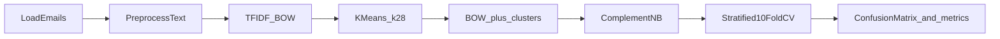

# Spam Classifier (Naive Bayes)

Binary spam/ham email classifier built on the **SpamAssassin** corpus using **TF-IDF Bag-of-Words**, **K-Means cluster features**, and **Complement Naive Bayes**, evaluated with **stratified 10-fold cross-validation** (out-of-fold predictions only).

## Results

| Metric | Value |
|--------|-------|
| Accuracy (CV) | 95.62% |
| ROC AUC | 0.9927 |
| Ham precision / recall | 98.09% / 95.97% |
| Spam precision / recall | 89.02% / 94.58% |

Samples: 9,352 emails after preprocessing (74% ham, 26% spam).

## Pipeline



**Design choices:** ComplementNB for class imbalance; $k=28$ clusters from silhouette score on a sample; TF-IDF with unigrams and bigrams; no train/test split (CV-only per project requirements).

## Quick start

```bash
pip install -r requirements.txt
```

Set up data (see [data/README.md](data/README.md)), then:

```bash
python spam_classifier.py
```

Figures are written to `figures/`. The written report is in [docs/report.pdf](docs/report.pdf).

## Repository layout

| Path | Description |
|------|-------------|
| `spam_classifier.py` | End-to-end pipeline |
| `spam_classifier.ipynb` | Notebook walkthrough |
| `figures/` | Generated plots |
| `docs/report.tex`, `docs/report.pdf` | LaTeX report and PDF |
| `data/spamassassin/` | SpamAssassin corpus (not in git; see data README) |

## Tech stack

Python, scikit-learn, NumPy, SciPy, matplotlib, seaborn.

## Author

Tom Hines — Southern Methodist University, *Quantifying the World* (Case Study 3).
