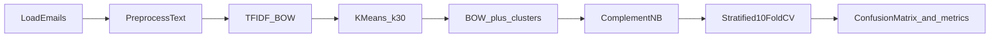
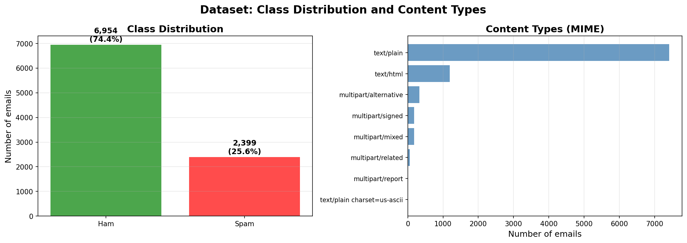
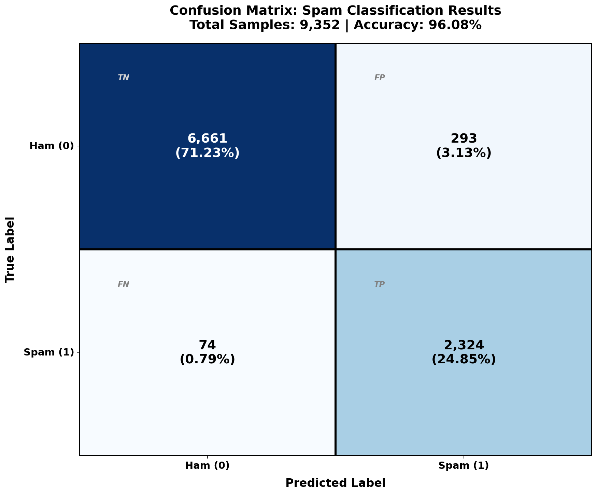
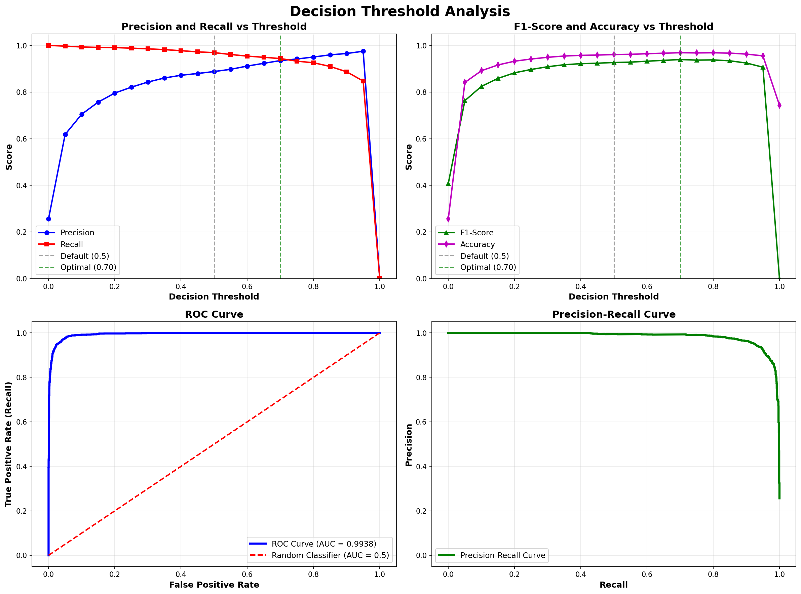

# Spam Classifier (Naive Bayes)

Binary spam/ham email classifier on the **SpamAssassin** public corpus. The pipeline combines **TF-IDF Bag-of-Words**, **Mini-Batch K-Means cluster features**, and **Complement Naive Bayes**, evaluated with **stratified 10-fold cross-validation** (out-of-fold predictions only).

**License:** [MIT](LICENSE)

## Results

| Metric | Value |
|--------|-------|
| Accuracy (CV) | 96.08% |
| ROC AUC | 0.9938 |
| Ham precision / recall | 98.90% / 95.79% |
| Spam precision / recall | 88.80% / 96.91% |

Dataset: 9,352 emails after preprocessing (74% ham, 26% spam). Confusion matrix (out-of-fold): 6,661 TN, 293 FP, 74 FN, 2,324 TP.

## Pipeline



**Design choices**

- **ComplementNB** — handles class imbalance better than standard Multinomial NB
- **TF-IDF** — 3,000 features, unigrams + bigrams
- **K-Means (k=30)** — cluster count chosen by silhouette score on a 3,000-email sample; one-hot cluster IDs concatenated to the BOW matrix
- **CV-only evaluation** — no held-out test set; every sample predicted out-of-fold to avoid leakage

## Key figures







## Quick start

**Requirements:** Python 3.10+ (tested on 3.13). Full pipeline runtime is ~45 seconds on a typical laptop.

```bash
git clone https://github.com/Rhines7/spam-classifier-naive-bayes.git
cd spam-classifier-naive-bayes
pip install -r requirements.txt
```

### 1. Set up data

The raw email corpus is **not** included in this repository (~9,350 files). Follow [data/README.md](data/README.md) to download or link the SpamAssassin corpus under `data/spamassassin/`.

Expected layout:

```text
data/spamassassin/
├── easy_ham/
├── easy_ham_2/
├── hard_ham/
├── spam/
└── spam_2/
```

Quick check:

```bash
python -c "from pathlib import Path; p=Path('data/spamassassin'); print('OK' if p.is_dir() and any(p.iterdir()) else 'Missing data')"
```

### 2. Run the pipeline

```bash
python spam_classifier.py
```

Figures are written to `figures/` (7 PNGs). For a step-by-step walkthrough, open [`spam_classifier.ipynb`](spam_classifier.ipynb).

### 3. Read the report

Written analysis: [docs/report.pdf](docs/report.pdf) (LaTeX source: [docs/report.tex](docs/report.tex)).

## Project structure

```text
spam-classifier-naive-bayes/
├── spam_classifier.py       # Entry point and public API re-exports
├── classifier/              # Implementation package
│   ├── config.py            # Paths and random seed
│   ├── io.py                # Load and explore emails
│   ├── preprocess.py        # Text cleaning
│   ├── features.py          # TF-IDF and clustering features
│   ├── model.py             # Cross-validation and metrics
│   ├── viz.py               # Plotting
│   └── pipeline.py          # End-to-end orchestration
├── spam_classifier.ipynb    # Notebook walkthrough
├── figures/                 # Generated plots (committed for README/report)
├── docs/                    # LaTeX report and PDF
├── data/
│   └── README.md            # Dataset setup (corpus not in git)
├── requirements.txt
└── LICENSE
```

| Path | Description |
|------|-------------|
| `spam_classifier.py` | Run with `python spam_classifier.py` |
| `classifier/` | Core modules (`io`, `preprocess`, `features`, `model`, `viz`, `pipeline`) |
| `spam_classifier.ipynb` | Phase-by-phase notebook (imports from `spam_classifier.py`) |
| `figures/` | Output plots; key figures embedded above |
| `docs/` | Full written report |
| `data/spamassassin/` | Local dataset directory (gitignored) |

## Tech stack

Python · scikit-learn · NumPy · SciPy · matplotlib · seaborn

## Limitations

- Corpus is dated (early 2000s email); language and spam tactics have evolved
- Bag-of-words only — no sender reputation, headers, or metadata beyond subject/body text
- Static model — no online learning or deployment layer

## Author

Tom Hines (2026)
